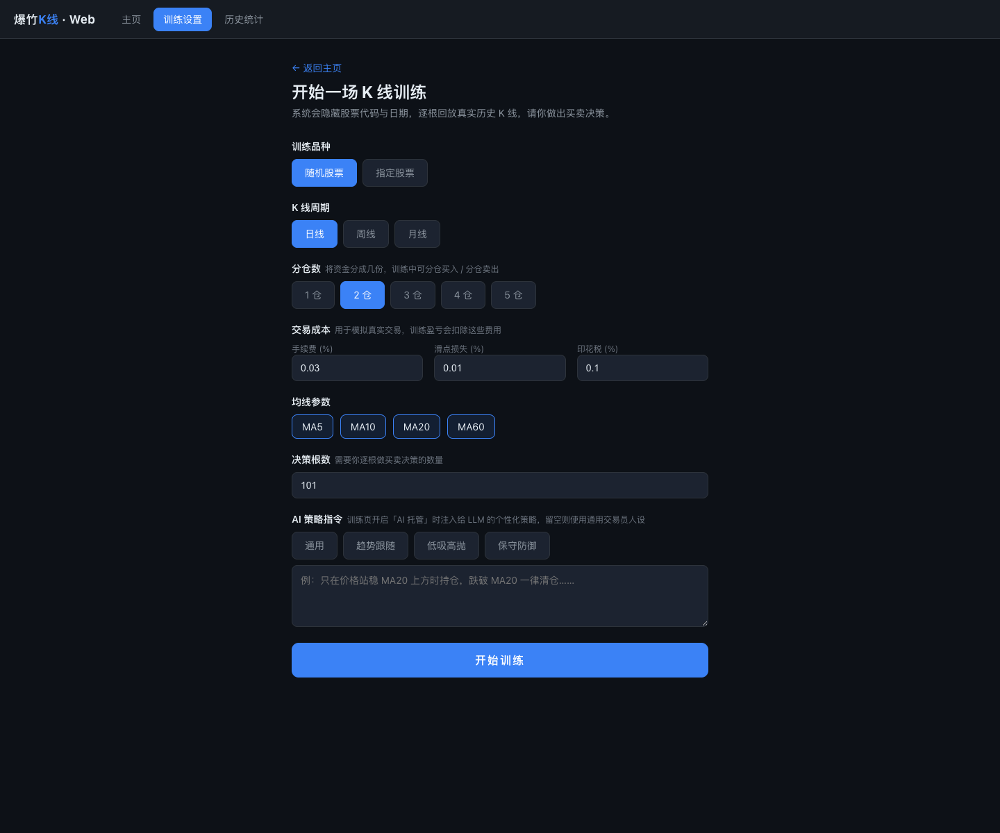
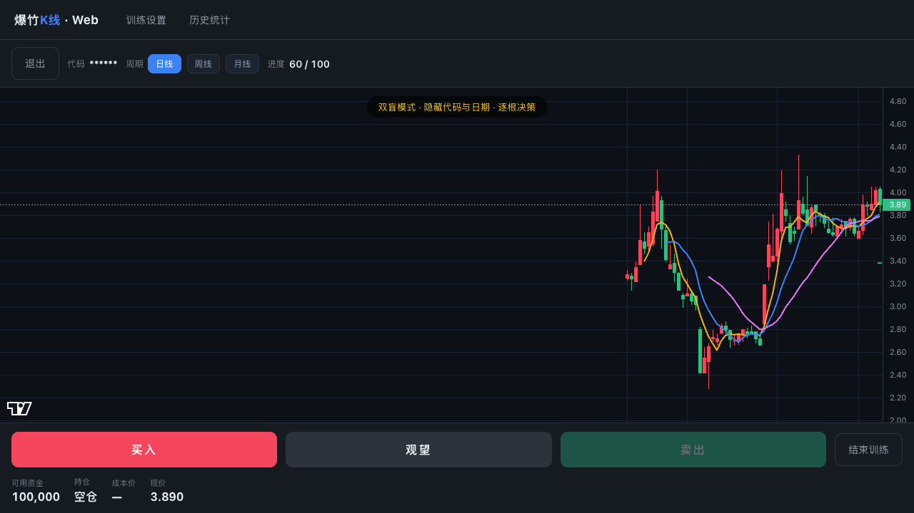
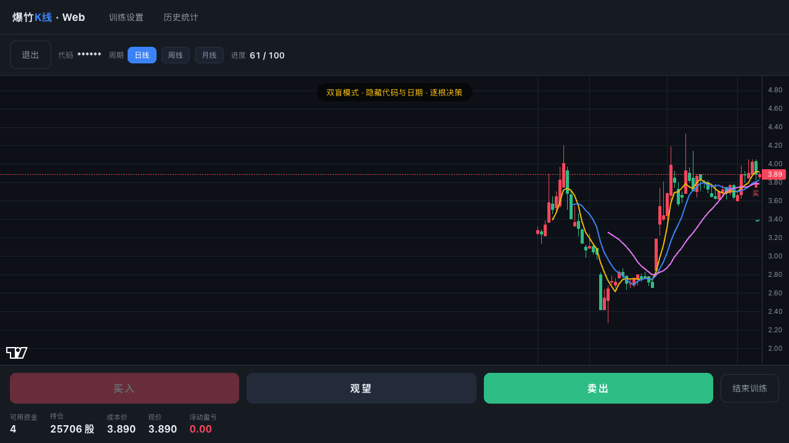
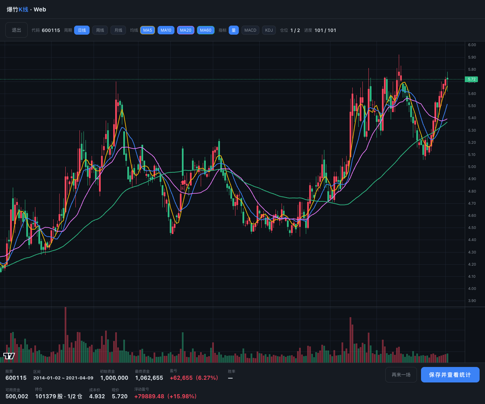
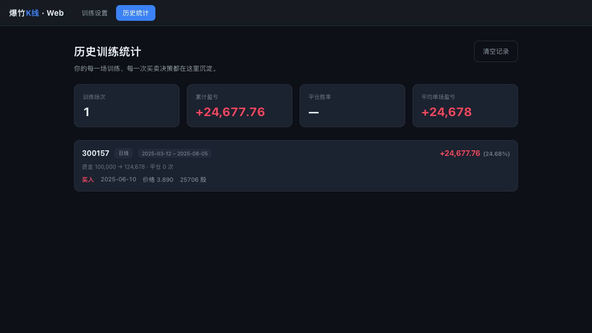

# quant_kline_human_ai_training

> A 股 K 线「双盲」训练场 —— 你和 AI 在同一段真实历史行情里逐根决策，看谁做得更好。

一个在本地运行的交易训练小工具：系统随机抽一段真实历史行情（**隐藏股票代码和日期**），逐根回放 K 线，由你决定每一根怎么操作；也可以把决策权交给 AI（DeepSeek 大模型），看它每一步的买卖理由，和你的水平比一比。

## 它能干什么

| 功能 | 说明 |
|---|---|
| 🔒 双盲回放 | 随机抽取历史行情段，隐藏代码与日期，逐根揭示，杜绝"我知道后面怎么走"的作弊 |
| 📈 分仓交易 | 资金等分成 1~5 份，每根 K 线可选买入 1~N 份 / 卖出 1~N 份 / 观望，模拟真实的分批建仓减仓 |
| 📊 多周期 + 指标 | 日 / 周 / 月 K 线切换，MA / 成交量 / MACD / KDJ 副图 |
| 🤖 AI 托管 | DeepSeek 逐根决策，实时展示决策理由；三档速度，随时暂停、随时人工接管 |
| 📝 策略指令 | 给 AI 注入自定义策略（趋势跟随 / 低吸高抛 / 保守防御，或自由编写），测不同策略谁更强 |
| 🏆 成绩结算 | 盈亏、胜率、与"区间本身涨幅"对比（跑没跑赢躺平不动），人机模式标记（手动 / AI / 混合） |

## 页面一览

| 训练设置 | 训练页（双盲逐根决策） |
|:---:|:---:|
|  |  |

| 买入后 | 结算页 | 历史统计 |
|:---:|:---:|:---:|
|  |  |  |

## 快速开始

### 环境要求

- Node.js 18 及以上
- 行情数据：本地 CSV 文件（见下方「行情数据格式」），默认读取 `~/Documents/mainland_data_2014` 目录（**前复权**数据）

### 安装与启动

```bash
git clone https://github.com/flybirp/quant_kline_human_ai_training.git
cd quant_kline_human_ai_training

# 安装依赖
cd server && npm install && cd ..
cd web && npm install && cd ..

# 终端 1：启动后端（端口 8787）
cd server && npm run dev

# 终端 2：启动前端（端口 5173）
cd web && npm run dev
```

打开浏览器访问 **http://localhost:5173** 即可开始。

### 行情数据格式

每个股票一个 CSV 文件（文件名即股票代码，如 `600519.csv`），放到数据目录（默认 `~/Documents/mainland_data_2014`，可用环境变量 `DATA_DIR` 修改），每行格式：

> 数据需为**前复权**行情（已按分红送股做价格调整），保证跨除权除息日的 K 线连续可比，否则复权跳空会干扰买卖判断与收益计算。`~/Documents/mainland_data_2014` 即存放前复权数据。

```csv
date,open,close,high,low,volume
2014-01-02,10.00,10.20,10.30,9.90,1234567
2014-01-03,10.20,10.10,10.25,10.05,987654
```

> 注意列顺序是 `开,收,高,低,量`（open, close, high, low, volume），与常见行情导出格式一致，第一行为表头。

### 配置 AI 托管（可选，不配也能玩）

AI 托管需要一个大模型 API Key，目前按 OpenAI 兼容格式对接（推荐 DeepSeek，便宜好用）：

1. 到 [DeepSeek 开放平台](https://platform.deepseek.com/) 注册并创建 API Key
2. 在 `server/` 目录下新建 `.env` 文件，写入：

```ini
LLM_BASE_URL=https://api.deepseek.com
LLM_API_KEY=sk-你的key
LLM_MODEL=deepseek-v4-flash
```

3. 重启后端即可。`.env` 已被 `.gitignore` 排除，不会被提交。

## 怎么玩

### 一场训练的流程

1. **设置参数**：训练页 → 选随机股票或指定代码、K 线周期（日/周/月）、分仓数（1~5 份）、决策根数、手续费率等
2. **逐根决策**：每根 K 线收盘后，选择「买入 N 份 / 观望 / 卖出 N 份」；图表上会打上你的买卖标记
3. **结算成绩**：训练结束（或提前点「结束训练」）后查看盈亏、胜率，保存进历史统计

### AI 托管怎么用

1. 训练页控制栏点 **「AI 托管」** 开关（开启后人工按钮自动禁用）
2. 选择速度：慢（看清楚每一步）/ 快 / 极速（尽快跑完一整场）
3. 图表下方的状态条实时显示 AI 的决策理由，例如：

   > AI 买入1份 —— 日线站上MA5/MA20且周线多头排列，量能温和，趋势向上，先建半仓试探

4. 随时点开关关闭 = **立即人工接管**，同一场训练可以人机混跑（结算会标记为"人机混合"）
5. 想改变 AI 的风格？设置页底部「**AI 策略指令**」提供了三个预设模板（趋势跟随 / 低吸高抛 / 保守防御），也可以自由编写，比如"只在价格站稳 MA20 上方时持仓，跌破一律清仓"

### 双盲的公平性

AI 和你看到的信息**完全一致**：只有已揭示的 K 线（隐藏日期，用序号代替）、多周期走势（日/周/月各最近 80 根，附 MA5/MA20/MA60）、当前持仓状态。不给任何指标数值（MACD/KDJ 等），避免大模型对特定指标产生教科书式的条件反射——它和你一样，只能靠看走势做判断。

## 项目结构

```
├── server/                 # Express 后端
│   ├── index.js            #   K线数据 API / LLM 代理接口 / AI 决策日志
│   └── .env                #   LLM 配置（自行创建，不入库）
├── web/                    # React + Vite 前端
│   └── src/pages/          #   Home / Settings / Training / Stats 四个页面
└── (数据目录)               # ~/Documents/mainland_data_2014，前复权行情 CSV
```

## 常见问题

**Q：训练数据从哪来？**
自己准备 CSV（可以从行情软件或数据源导出），按上面的格式放到数据目录。没有数据时后端启动会提示股票数量为 0。

**Q：AI 托管费钱吗？**
以 DeepSeek flash 档模型为例，跑完一场 101 根决策的训练约消耗几十万输入 token，成本在几毛钱量级。

**Q：AI 会"偷看"未来行情吗？**
不会。数据是逐根揭示的，AI 每次只能看到当前及之前已揭示的 K 线；股票代码和日期对它也是隐藏的（双盲），训练数据即使出现在大模型的训练语料里，它也无法对上号。

**Q：中途切换周期（日→周）会重置进度吗？**
不会。切换只是改变 K 线的折叠粒度，进度、持仓、时间线全部保留。

**Q：我的成绩存在哪？**
浏览器 localStorage，纯本地，不上传任何服务器。
