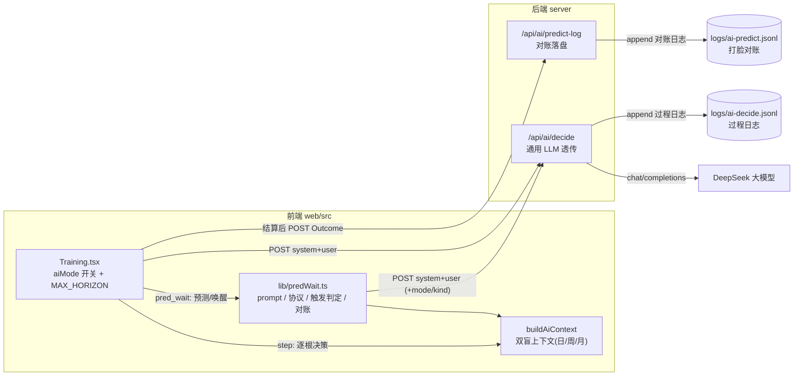
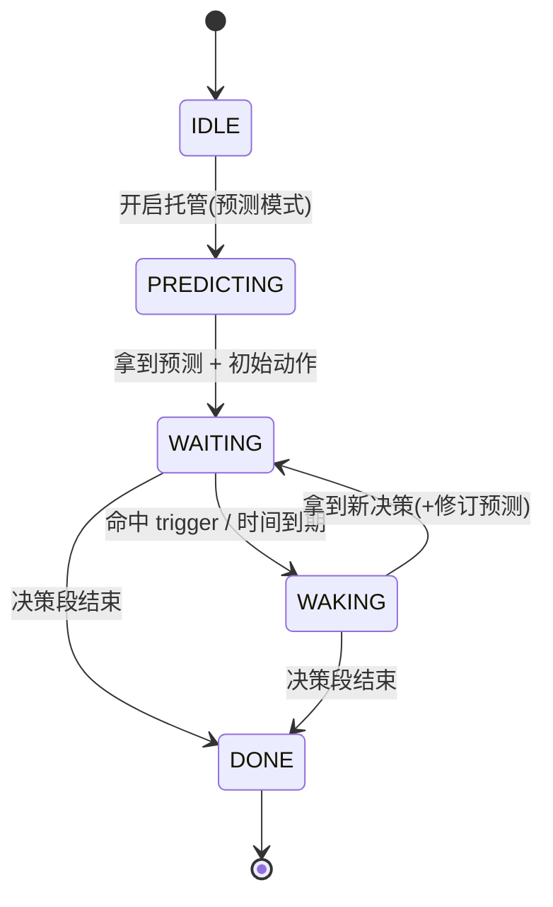
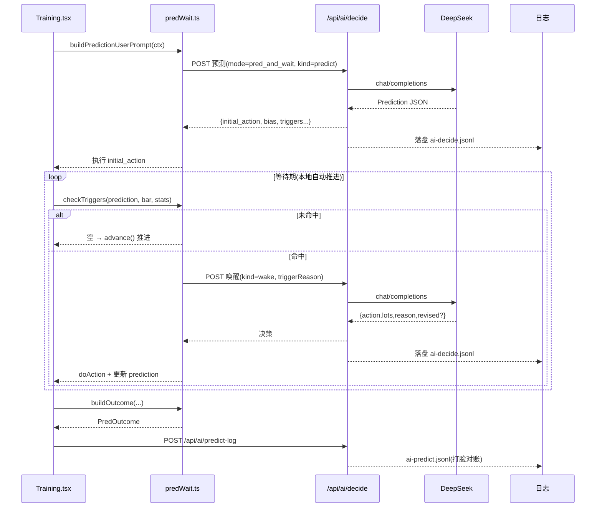

# pred_and_wait 子模式升级方案

> 目标：在现有「AI 托管（逐根决策）」之上，新增一个「预测等待（pred_and_wait）」子模式 —— AI 在第 0 天对未来 n 天走势做一次结构化预测，之后**不逐根请求 AI**，仅在命中预测条件时才唤醒 AI 重新评估。同时把预测与「打脸」结果结构化落盘，供未来让 AI 自我学习。

---

## 目录

1. [现状回顾](#1-现状回顾)
2. [总体设计](#2-总体设计)
3. [架构图](#3-架构图)
4. [隔离边界](#4-隔离边界)
5. [协议设计](#5-协议设计)
6. [触发与跳过机制](#6-触发与跳过机制)
7. [AI 回复区展示](#7-ai-回复区展示)
8. [日志与打脸对账](#8-日志与打脸对账)
9. [改动点清单](#9-改动点清单)
10. [已确认决策](#10-已确认决策)

---

## 1. 现状回顾

现有 AI 托管链路（`step` 逐根决策模式）：

```
aiSchedule → aiDecideOnce → buildAiContext → buildAiUserPrompt
           → fetch('/api/ai/decide') → doAction → advance()
           → useEffect 重新调度 → 下一根
```

关键事实：

- **后端** `server/index.js` 的 `/api/ai/decide` 是一个**通用 LLM 透传**：接收 `{system, user}`，返回 `{action, lots, reason}`（`action ∈ buy|sell|hold`）。
- **前端** `web/src/pages/Training.tsx` 承载全部决策循环：`buildAiContext()` 产出双盲上下文（日/周/月 K 线 + 持仓 + 近 20 根统计 + 决策记忆）。
- **推进**：`advance()` 每调用一次推进一根（日线 +1，周/月推进到下一周期末）。
- **日志**：`logAiDecision()` 把每次 LLM 调用写进 `server/logs/ai-decide.jsonl`。

pred_and_wait 需要**复用**这套上下文与代理，只替换「调度与触发」逻辑。

---

## 2. 总体设计

在现有 `step` 之外增加并行的 `pred_and_wait` 模式，二者共用后端代理与双盲上下文，差异只在调度：

| | `step`（逐根决策） | `pred_and_wait`（预测等待） |
|---|---|---|
| 触发时机 | 每根 bar 都请求 AI | 第 0 天请求一次，之后仅在命中条件时请求 |
| 中间 bar | 逐根决策 | **本地自动推进，不请求 AI** |
| 请求次数 | ≈ 决策根数 | ≈ 1 + 命中次数 |
| 输出 | `{action, lots, reason}` | 第 0 天输出预测；唤醒时输出决策 + 可选修订预测 |

完整流程：

```
第0天:  请求AI → 预测 + 初始动作(先建仓/观望) → 执行初始动作
等待期: 本地逐根推进，不请求AI，每根做触发判定
         ├─ 未命中 → 直接 advance（持仓不动）
         └─ 命中   → 唤醒AI(传入: 原始预测 + 触发原因 + 当前走势)
                     → AI返回新决策(可附修订预测) → 执行 → 回等待期
结束:   决策段走完 → 结算 → 生成"打脸对账"日志
```

---

## 3. 架构图



### 状态机



### 时序



---

## 4. 隔离边界

### 新增独立文件 `web/src/lib/predWait.ts`

只做纯逻辑，不碰 UI / 图表：

| 导出 | 作用 |
|---|---|
| `PRED_WAIT_SYSTEM_PROMPT` | 该模式专用 system prompt |
| `type Prediction / PredTrigger / PredWakeEvent / PredOutcome` | 协议类型 |
| `buildPredictionUserPrompt(ctx)` | 第 0 天预测请求的 user prompt |
| `buildWakeUserPrompt(prediction, reason, ctx)` | 唤醒时请求的 user prompt |
| `checkTriggers(prediction, bar, stats): TriggerHit[]` | 纯函数：判定当前 bar 是否命中预测 |
| `buildOutcome(...): PredOutcome` | 训练结束时的对账计算 |

### `Training.tsx` 薄接入

只加最小改动，**现有 `step` 逻辑一行不动**：

- 新增 `aiMode: 'step' | 'pred_wait'` state
- 新增常量 `MAX_HORIZON = 15`（预测天数上限，写进 `PRED_WAIT_SYSTEM_PROMPT`）
- 控制栏 AI 区加一个 seg：`逐根 / 预测`（预测天数 n 由 LLM 自定，前端不设输入）
- 调度器加一个分支：`aiMode === 'pred_wait'` 走 `pwSchedule/pwWakeOnce`，否则走现有 `aiSchedule/aiDecideOnce`

### 后端最小改动

- `/api/ai/decide`：body 额外接收可选 `mode`、`kind`，原样写进 `logAiDecision` 的 entry（约 3 行）。
- 新增 `POST /api/ai/predict-log`：把对账记录追加到 `server/logs/ai-predict.jsonl`。

---

## 5. 协议设计

### 5.1 第 0 天「预测」请求

- system prompt（`PRED_WAIT_SYSTEM_PROMPT`）：只能看已揭示数据、输出严格 JSON、预测必须结构化为「可判定条件」而非纯文字。
- user prompt：复用现有双盲上下文，额外要求 AI 先给出预测天数（未来多少个交易日，≤ `MAX_HORIZON`），再给出结构化预测。

**预测响应（Prediction）**：

```jsonc
{
  "horizon": 10,                    // 预测未来天数（交易日，日线粒度；LLM 自定，1~MAX_HORIZON，默认上限 15）
  "initial_action": "buy | hold",   // 预测同时先给一步动作（是否先建仓，自由度交给 LLM）
  "initial_lots": 1,                // initial_action=buy 时的份数
  "bias": "up | down | sideways",   // 总体方向判断（粗粒度，用于最终打脸）
  "expected_range": { "low": 10.0, "high": 12.8 }, // 预期震荡区间（可选）
  "triggers": [                     // 结构化触发条件（程序据此自动判定何时唤醒AI）
    { "id": "t1", "kind": "break_up",         "value": 12.5, "desc": "放量突破12.5看主升" },
    { "id": "t2", "kind": "break_down",       "value": 10.2, "desc": "跌破10.2止损" },
    { "id": "t3", "kind": "volume_ratio_gt",  "value": 2.0,  "desc": "异常放量需重评" }
  ],
  "summary": "预计未来10日在10.0~12.8震荡偏多"
}
```

**`trigger.kind` 枚举**（只保留程序可自动判定的类型，减少 AI 乱输出）：

| kind | 判定语义 | `value` 含义 |
|---|---|---|
| `break_up` | 价格上破 | 目标价（元），`bar.high >= value` 命中 |
| `break_down` | 价格下破 | 目标价（元），`bar.low <= value` 命中 |
| `volume_ratio_gt` | 放量 | 量比阈值，`最新量/基准均量 >= value` 命中 |
| `volume_ratio_lt` | 缩量 | 量比阈值，`最新量/基准均量 <= value` 命中 |

> 未来可选（趋势类触发）：趋势预测（稳步上涨/稳步下跌）中支撑/压力价随时间移动，AI 难以给出固定价位；届时可增补**单日涨跌幅**触发 —— `pct_up_gt`（单日涨幅 ≥ `value`%）、`pct_down_gt`（单日跌幅 ≥ `value`%）。当前版本**暂不实现**，趋势类暂用 `break_up/break_down` 给宽止损/止盈价凑合。

> 说明：时间轴以**日线交易日**为最小单位 —— `horizon` 由 LLM 自定（提示词中作为问题提出，上限 `MAX_HORIZON = 15` 个交易日，超限按 15 截断）；AI 虽然同时看到日/周/月多周期走势，但预测、`trigger` 判定与 `time_reached`（第 horizon 个交易日到期）一律按**天**进行，不随训练显示的周期折叠。`横盘震荡 / 稳步上涨 / 放量缩量` 等自然语言，都通过 `bias` + `expected_range` + `triggers` 结构化表达，不保留模糊字段。

### 5.2 触发唤醒后的「重新评估」响应

复用现有决策协议并允许附修订预测：

```jsonc
{
  "action": "buy | sell | hold",
  "lots": 1,
  "reason": "跌破10.2止损位，清仓离场",
  "revised": { /* 可选，同 Prediction 结构，不填则沿用原预测 */ }
}
```

程序对 `lots` 继续 clamp（`buy` 不超过可买份数、`sell` 不超过持仓份数），非法值降级为 `hold`。

### 5.3 枚举汇总

| 字段 | 枚举值 / 取值 |
|---|---|
| `horizon` | 整数（单位：交易日），LLM 自定，`1 ~ MAX_HORIZON`（默认 15 天） |
| `bias` | `up` / `down` / `sideways` |
| `trigger.kind` | `break_up` / `break_down` / `volume_ratio_gt` / `volume_ratio_lt` |
| `initial_action` / 唤醒 `action` | `buy` / `sell` / `hold` |
| 内置触发 | `time_reached` |

---

## 6. 触发与跳过机制

### 状态机

```
IDLE → PREDICTING(第0天请求) → WAITING(本地自动推进) → WAKING(命中后请求) → WAITING → ... → DONE
```

### 等待期自动推进（关键：怎么"跳过"）

不请求 AI 的 bar，用独立调度器 `pwSchedule()` 驱动（复用现有「单 pending timer + ref 防重入」思路，但不发请求）：

```
pwSchedule():
  清除旧 timer
  若未开启 / 已结束 / loading → return
  setTimeout(每根间隔 = aiSpeed, 复用现有"慢/快/极速"):
    命中判定 checkTriggers(prediction, currentBar, stats)
    若命中任意 trigger（或到达 dayWarmup+horizon）:
        → 停止自动推进，调 pwWakeOnce() 请求AI
    否则:
        → advanceDay()   // 按「天」推进一根日线，不交易、不请求AI（持仓不动）
        → pwSchedule() 继续下一根
```

> 等待期按**日线逐天推进**（`advanceDay()`，即 `dayVisible + 1`），与训练显示周期（日/周/月）解耦 —— 因为预测与触发都是天级别的。

`checkTriggers` 为纯函数，入参是**当前已揭示的最后一根「日线」bar + 统计量**（预测与触发按天判定，与训练显示周期解耦）：

- `break_up`：`bar.high >= value`
- `break_down`：`bar.low <= value`
- `volume_ratio_gt/lt`：`bar.volume / 基准均量`（基准均量 = 预测日之前的近 20 日均量，与现有 `volumeRatio` 口径一致）比对 `value`
- `time_reached`：`dayVisible >= predStartDay + prediction.horizon`（horizon 单位 = 交易日，由 LLM 输出，上限 MAX_HORIZON）

命中时记录**触发原因**（哪个 trigger / 时间到期），作为唤醒 AI 的入参。

### 唤醒 AI（`pwWakeOnce`）

```json
POST /api/ai/decide
body: {
  mode: "pred_and_wait",
  kind: "wake",                       // 日志标记
  system: PRED_WAIT_SYSTEM_PROMPT,
  user: buildWakeUserPrompt(prediction, triggerReason, ctx)
}
```

`buildWakeUserPrompt` 把「原始预测 + 本次触发原因 + 当前双盲走势 + 持仓」拼给 AI，让它知道"我之前预测了什么，现在为什么被叫醒"。

### 边界处理

- 预测响应里的 `triggers` 若为空或全部非法（`value` 非有限数），程序降级为**仅靠 `time_reached`** 唤醒，保证不卡死。
- 决策段结束 `dayVisible >= decisionEndDay` → 直接 `setFinished(true)`，不再请求。
- 关闭托管开关的完整语义见下方「人工接管（方案 A）」。

### 人工接管（方案 A）

与 `step` 模式共用同一个「托管」开关（`aiAuto`），语义一致：**运行 / 暂停**。

| 操作 | 行为 |
|---|---|
| **关闭托管** | 立即停止调度（清 `pwTick` timer + 在途 LLM 返回后经 `aiAutoRef` 校验丢弃）；**当前预测作废**，`trigger` 不再自动触发，等待期按天自动推进立即停止；买卖按钮恢复，人工从当前 bar 逐根决策（等价退化成普通人工训练，推进粒度回到训练周期的日/周/月） |
| **重新开启托管** | AI 以**当前已揭示 bar 为新「第 0 天」**重新做一次预测（新 session），**不延续旧预测** |

> 理由：人工中途介入后，旧预测的前提（持仓、走势）已变，延续旧预测会产生「预测部分失效」的歧义，故重开即重预测。

**人机混跑标记**：AI 的预测/唤醒 → `aiUsedRef = true`；AI 的 `initial_action` 与唤醒 buy/sell 的 `actor='ai'`；人工接管期间的交易 `actor='human'`。`buildRecord` 现有推导天然兼容，产出 `mixed`，无需改动。

**托管开启时**：`buy/sell/hold` 按钮 `disabled`（与 `step` 一致），只有关闭托管才能人工操作。

---

## 7. AI 回复区展示

现状：`ai-bar` 是单行条（`min-height:30px`），只显示最新一条 `aiReason`，单行 `ellipsis` 截断；`aiLogsRef` 虽存滚动窗口但只喂 LLM、不展示。`pred_and_wait` 返回字段更多、信息量更大，需要升级为可滚动卡片面板。

### 7.1 数据结构：`aiMessages`

新增 `aiMessages: AiMessage[]`（React state，专用于渲染），与 `aiLogsRef` **彻底分离**：

- `aiLogsRef` 继续当「决策记忆」喂 LLM（精简文本 + 截断），**不动**。
- `aiMessages` 存结构化消息供 UI 展示，**全量保留**（不截断）。

消息用判别联合，统一放 `web/src/lib/aiMessages.ts`：

```ts
type AiMessage =
  | { id: string; ts: number; kind: 'step';
      action: 'buy' | 'sell' | 'hold'; lots?: number; reason: string }
  | { id: string; ts: number; kind: 'predict';
      horizon: number; bias: 'up' | 'down' | 'sideways';
      initial_action: 'buy' | 'hold'; initial_lots?: number;
      expected_range?: { low: number; high: number };
      triggers: PredTrigger[]; summary: string }
  | { id: string; ts: number; kind: 'wake';
      triggerReason: string; action: 'buy' | 'sell' | 'hold';
      lots: number; reason: string; revised?: Prediction }
  | { id: string; ts: number; kind: 'notice';
      text: string }                 // 系统提示，如「人工接管了」
```

### 7.2 UI：单行条 → 可滚动卡片面板

位置不变（`chart-area` 与 `control-bar` 之间），改造为 `AiLogPanel`：

- **固定高度**：约 `200px`（`flex-shrink:0`；`chart-area` 为 `flex:1` 自动让位）。
- **可上滑**：`overflow-y:auto`；新消息自动滚到底（`scrollTop = scrollHeight`）。
- **至少展示 3 条**：每条紧凑卡片 ~60px，默认可视 3 条。
- 面板**顶部 sticky 状态行**：保留「AI 思考中… / AI 已暂停：错误 / 托管中·已接管」。

### 7.3 卡片样式（兼容 step + pred_and_wait）

- `step`：动作徽标（买/卖/观望）+ `lots` + `reason`。
- `predict`：`bias` 方向徽标（↑多 / ↓空 / →横盘）+ `horizon` + `expected_range` + `triggers` 逐条列表 + `initial_action` + `summary`。
- `wake`：触发原因徽标（「跌破 10.2」/「时间到期」）+ `action/lots` + `reason` + 可选 `revised` 摘要。
- `notice`：居中弱化文本，用于「人工接管了」等系统提示。

### 7.4 已定规则

1. **面板高度**：固定（约 200px）。
2. **结束后保留**：`finished` 后仍保留面板做只读回顾。
3. **人工操作不进面板**：人工接管的交易不生成消息；但每次进入人工接管时插入一条 `notice`「人工接管了」。
4. **消息量**：全量保留，不截断。

---

## 8. 日志与打脸对账

分两类日志，**分文件**存储。

### 8.1 过程日志（复用 `server/logs/ai-decide.jsonl`）

每次 LLM 调用自动落盘，通过 `mode` + `kind` 区分：

```
{ ts, mode:"pred_and_wait", kind:"predict"|"wake", usage, system, user, raw, output }
```

→ 后端 `/api/ai/decide` 只在 body 解包时多取 `mode/kind` 两个字段并透传进日志 entry。

### 8.2 对账日志（新增 `server/logs/ai-predict.jsonl`）

训练结束时前端计算 `PredOutcome`，`POST /api/ai/predict-log` 追加一行，专供未来"让 AI 学习哪些预测被打脸"：

```jsonc
{
  "sessionId": "169...",
  "code": "600519",                 // 本地自用，不脱敏
  "mode": "pred_and_wait",
  "horizon": 10,
  "prediction": { /* 原始 Prediction 原样 */ },
  "actual": {                        // 程序按真实走势计算
    "bias": "down",                  // 首尾 close 涨跌方向
    "range": { "low": 10.1, "high": 11.9 },
    "maxDrawdown": 0.09
  },
  "triggerResults": [                // 每个预测触发是否真正命中
    { "id": "t1", "kind": "break_up", "value": 12.5, "hit": false },
    { "id": "t2", "kind": "break_down", "value": 10.2, "hit": true, "hitIndex": 5, "hitPrice": 10.1 }
  ],
  "wakeEvents": [                    // 每次实际唤醒后的决策
    { "reason": "time_reached", "action": "hold", "lots": 1, "aiReason": "..." }
  ],
  "score": {                         // 打脸分数，可直接喂给未来反思 prompt
    "biasCorrect": false,
    "rangeContainment": 0.65,        // 实际走势落在预期区间内的天数占比
    "triggerPrecision": 0.5          // 命中触发 / 预测触发
  },
  "ts": "2026-08-31T..."
}
```

`score` 三件套就是"打脸"的量化结果，未来可拼接成反思 prompt 或作为训练样本。

---

## 9. 改动点清单

| 文件 | 改动 | 量级 |
|---|---|---|
| `web/src/lib/predWait.ts` | **新增**：prompt / 类型 / 触发判定 / 对账 | 主要工作量 |
| `web/src/lib/aiMessages.ts` | **新增**：`AiMessage` 判别联合类型 + 展示辅助 | 小 |
| `web/src/components/AiLogPanel.tsx` | **新增**：AI 回复区面板（固定高度可滚动卡片） | 中 |
| `web/src/pages/Training.tsx` | 加 `aiMode` state、开关 UI、`pwSchedule/pwWakeOnce` 分支、`AiLogPanel` 接入 | 薄接入，不动 step 逻辑 |
| `web/src/index.css` | 新增 `.ai-log-panel` 等样式，替换单行 `.ai-bar` | 小 |
| `server/index.js` | `/api/ai/decide` 多透传 `mode/kind`；新增 `/api/ai/predict-log` | ~10 行 |

---

## 10. 已确认决策

1. **预测天数 `n` 谁定**：由 **LLM 自定**，作为提示词中的问题交给大模型回答，但上限 `MAX_HORIZON = 15`（即 **15 个交易日**）。AI 输出的 `horizon` 超过上限时按 15 截断。预测与触发一律按**天（交易日）**进行：AI 虽同时看日/周/月多周期，但预测是天级别的。
2. **第 0 天是否允许 AI 先建仓**：**允许**。自由度交给 LLM —— 当它预测后续会上涨时即可通过 `initial_action: "buy"` 先建仓；协议保留 `initial_action` 字段，不再限制"纯观察"。
3. **等待期推进速度**：**复用现有「慢/快/极速」**（`aiSpeed`），等待期每根 bar 的推进间隔与逐根模式共用同一档位，不引入新的独立速度配置。
4. **人工接管（方案 A）**：关闭托管 = 暂停 + **预测作废**；重新开启 = 以当前 bar 为「新第 0 天」重新预测，不延续旧预测。关闭后人工从当前 bar 逐根决策（等价普通人工训练），推进粒度回到训练周期；`mode` 标记沿用现有 `ai + 人工交易 → mixed` 推导，无需改动。
5. **AI 回复区展示**：单行 `ai-bar` 升级为固定高度（约 200px）可滚动卡片面板 `AiLogPanel`；消息全量保留、新消息自动滚底、可上滑回顾；`finished` 后仍保留只读回顾；面板只放 AI 回复（`step` 决策 / `pred_and_wait` 预测与唤醒），人工接管的交易不进面板，但每次接管时插入一条「人工接管了」系统提示。
